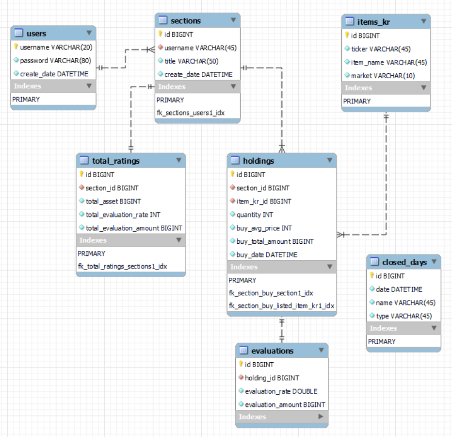
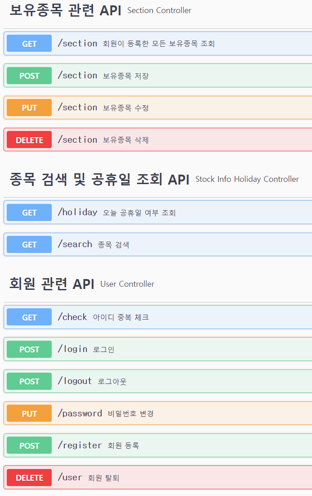
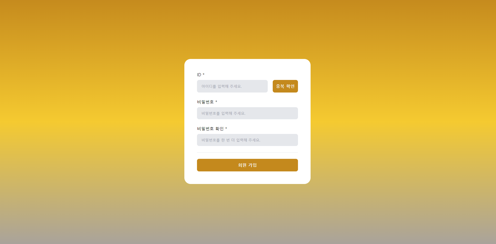
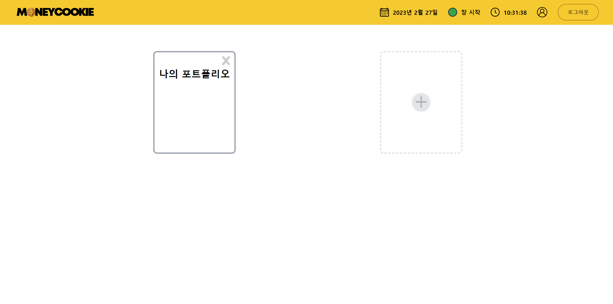
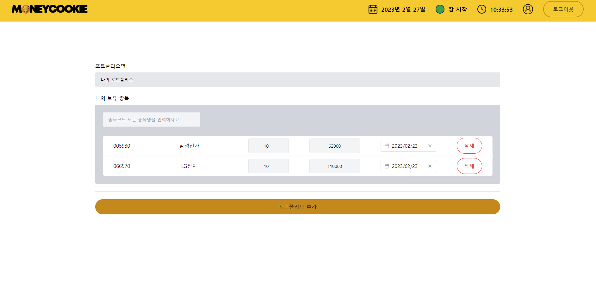
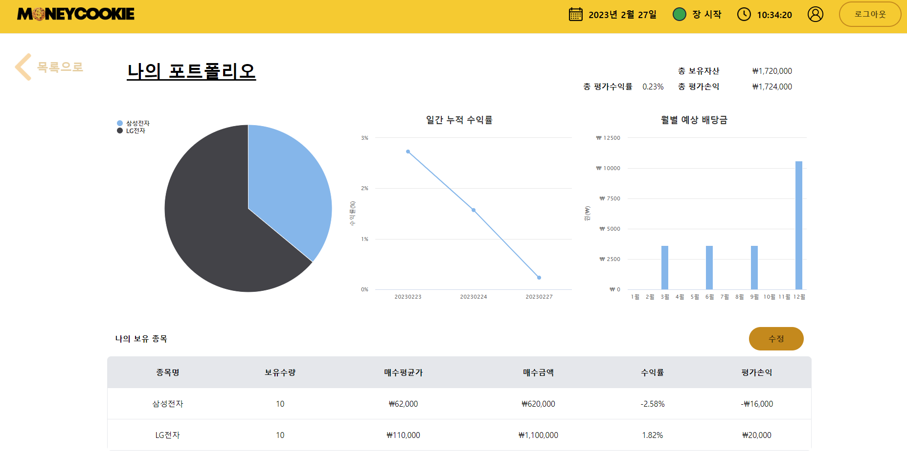
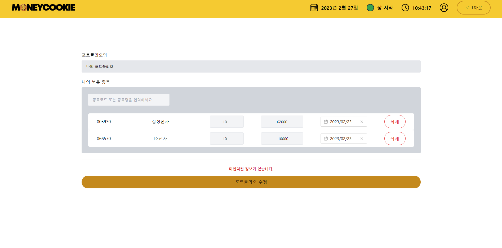
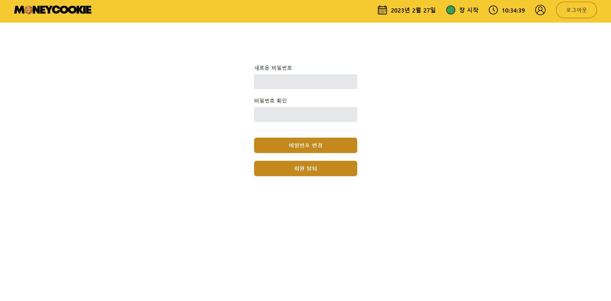

# MoneyCookie

## 💻 프로젝트 소개

- **프로젝트명** : MoneyCookie
- **프로젝트 기간** : 2022.11.25 ~ 2023.02.26
- 실시간 국내 주식 포트폴리오 관리 플랫폼

## ⚒ 사용 기술 및 개발 환경

**Frontend** : HTML, CSS, Tailwind CSS, Vue.js 3

**Backend** : JAVA 11, Spring Boot 2

**Database** : MySQL 8

**OS** : Windows 10

**Tools** : IntelliJ IDEA, MySQL Workbench 8

**Build Tool** : Gradle

## 📊 ER Diagram

## 🧮 API 명세

## 📑 주요 기능

- 로그인

- 회원 가입

- 회원이 저장한 보유 종목 리스트

- 보유 종목 추가

- 실시간 보유 종목 정보 조회

- 보유 종목 수정

- 회원 정보 조회 / 수정

