# MoneyCookie

## 💻 프로젝트 소개

- **프로젝트명** : MoneyCookie
- **프로젝트 기간** : 2022.11.25 ~ 2023.02.26
- 실시간 국내 주식 포트폴리오 관리 플랫폼

## ⚒ 사용 기술 및 개발 환경

**Frontend** : HTML, CSS, Tailwind CSS, Vue.js 3

**Backend** : JAVA 11, Spring Boot 2.7

**Database** : MySQL 8

**OS** : Windows 10

**Tools** : IntelliJ IDEA, MySQL Workbench 8

**Build Tool** : Gradle

## 🧩 주요 기능

● 회원이 주식 보유 종목을 등록하면 현재 수익률과 월별
배당금, 예상 평가금액 계산

● 차트를 통한 주식 데이터 시각화

● XML, JSON 파서를 별도로 구현해 주식 정보 크롤링 시에
재사용

● 클라이언트와 서버 간의 데이터 전달을 위해 Rest API 구현

● SockJS를 사용하여 실시간 주식 현재가 조회

● 전역 변수 관리를 위해 Vuex 사용

## 📊 ER 다이어그램

## 🧮 API 명세

## 🔄 API 시퀀스 다이어그램

로그인

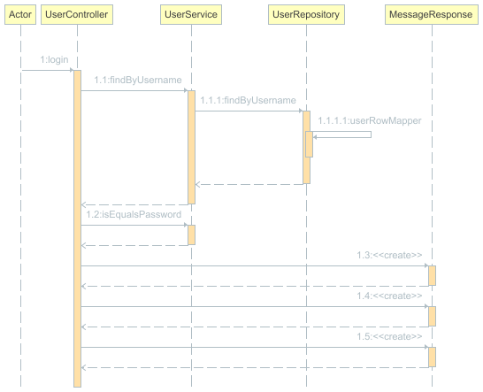

아이디 중복 체크

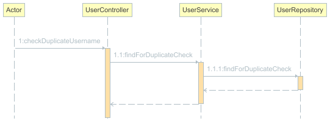

로그아웃

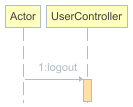

회원 가입

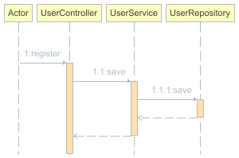

비밀번호 변경

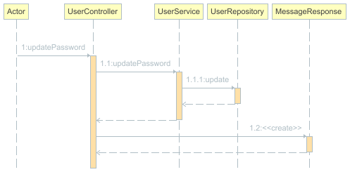

회원 탈퇴

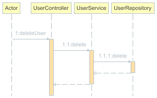

전체 보유종목 조회

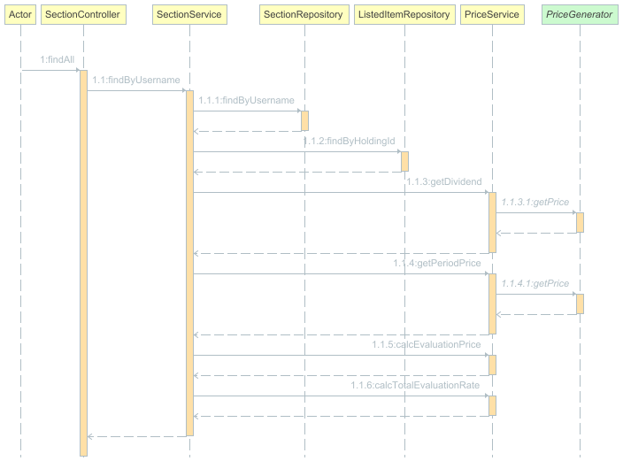

보유종목 저장

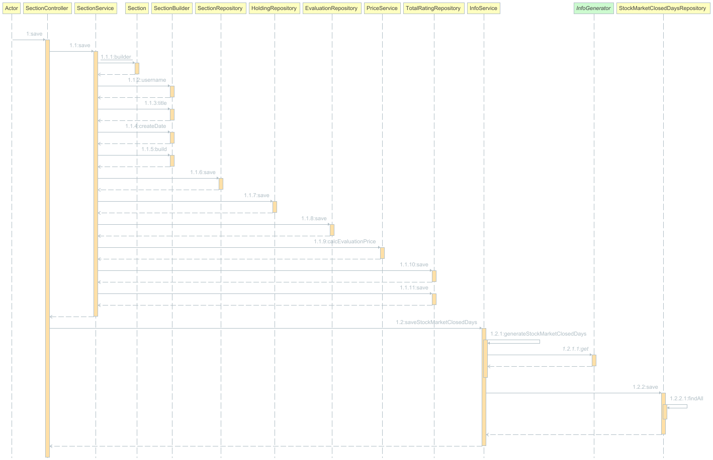

보유종목 수정

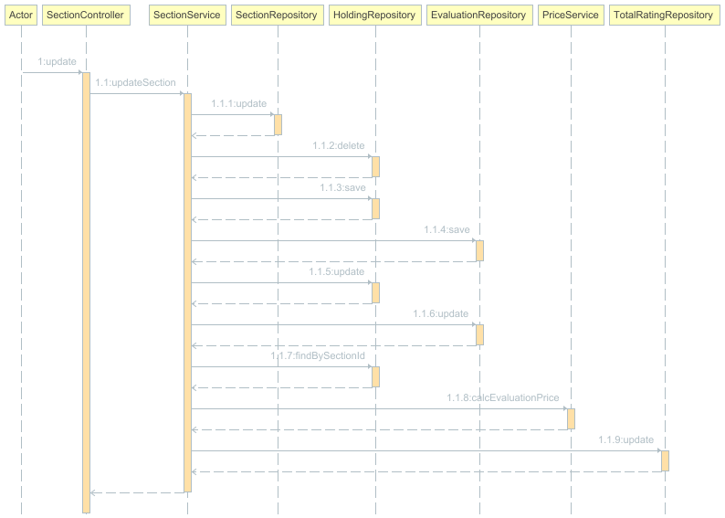

보유종목 삭제

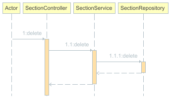

공휴일 조회

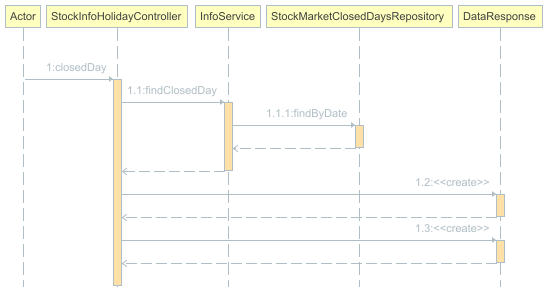

종목 검색

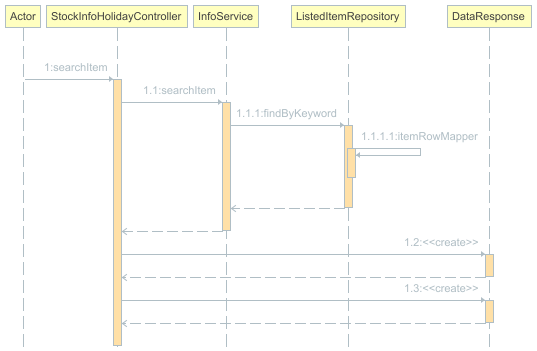

실시간 보유종목 정보 조회

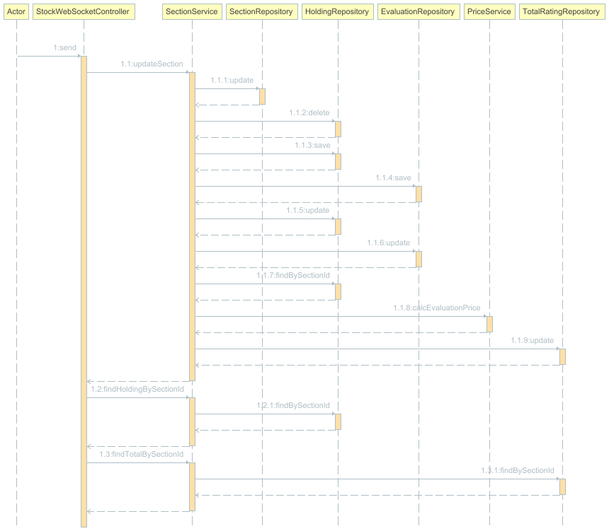

## 📑 화면 구성

- 로그인

- 회원 가입

- 회원이 저장한 보유 종목 리스트

- 보유 종목 추가

- 실시간 보유 종목 정보 조회

- 보유 종목 수정

- 회원 정보 조회 / 수정

